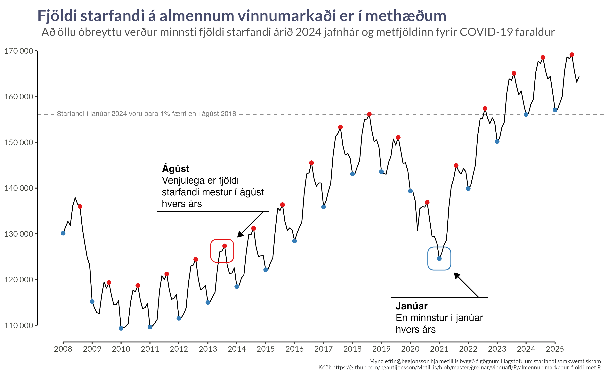
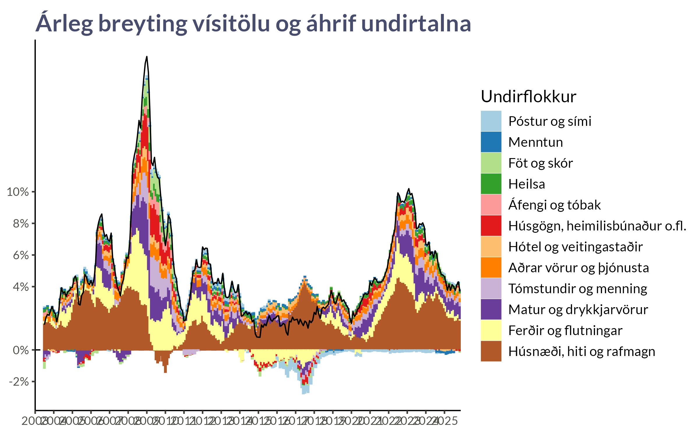
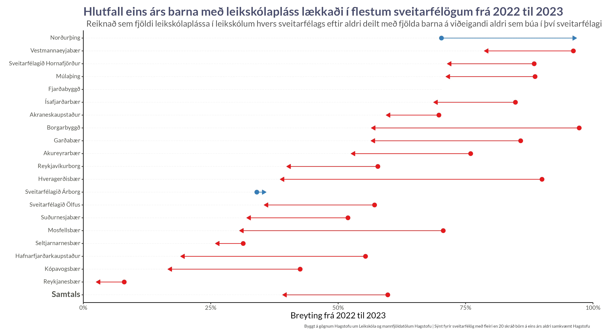

::: {.hero .column-screen-inset}

# Metill

**Notum gögn til að upplýsa, ekki sannfæra.**

::: {.featured}
[{.featured-image}](hagvisar/index.qmd)

[**Fjöldi starfandi á almennum vinnumarkaði er í methæðum**](hagvisar/index.qmd){.featured-title}

Að öllu óbreyttu verður minnsti fjöldi starfandi árið 2024 jafnhár og metfjöldinn fyrir COVID-19 faraldur.
:::

:::

## Nýjast {.column-page}

::: {#nyjast .column-page}
:::

::: {.no-content-message}
*Efni í vinnslu — fylgstu með!*
:::

## Efnisflokkar {.column-page}

::: {.section-cards}

::: {.section-card}
### [Hagvísar](hagvisar/index.qmd)
{.section-image}

Gagnastýrðar yfirlitssíður um verðbólgu, vinnumarkað, innflytjendur og fleira. Uppfært reglulega með nýjustu gögnum.
:::

::: {.section-card}
### [Íþróttir](ithrottir/index.qmd)
{.section-image}

Bayesian spálíkön fyrir íslenskar boltaíþróttir. Líkindadreifingar fyrir úrslit og styrk liða.
:::

::: {.section-card}
### [Verkfæri](verkfaeri/index.qmd)
{.section-image}

Gagnvirk mælaborð þar sem þú getur kannað og borið saman gögn á þinn eigin hátt.
:::

:::

## Um Metil {.column-page .um-metil-teaser}

Metill býður upp á ráðgjöf í **gagnablaðamennsku** og **Bayesian tölfræði** fyrir fyrirtæki, stofnanir og fjölmiðla sem vilja nýta gögn til að taka betri ákvarðanir.

[Nánar →](um/index.qmd)
