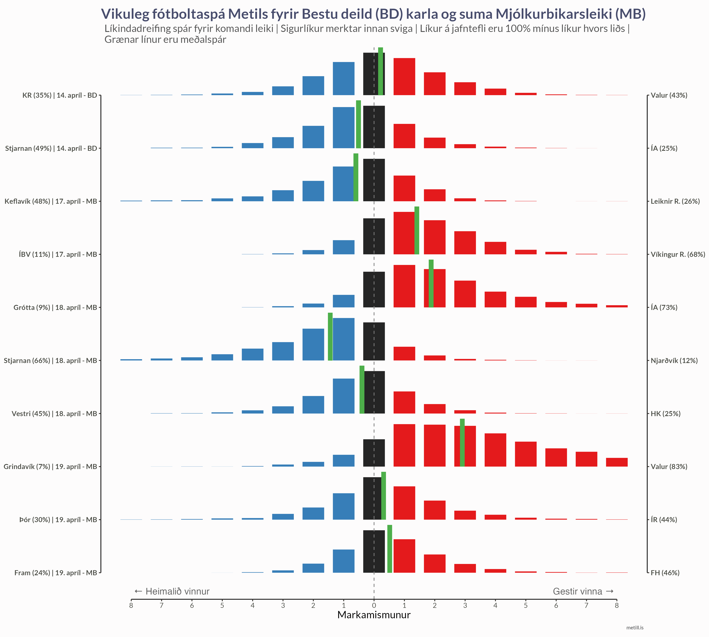

Metill notar Bayesian tölfræðilíkön til að spá fyrir um úrslit í íslenskum boltaíþróttum. Líkönin meta styrk hvers liðs og gefa líkindadreifingu fyrir væntanleg úrslit.

[Um spálíkönin →](um-spalikon/index.qmd){.methodology-link}

---

::: {.sport-cards}

::: {.sport-card}
### Körfubolti

{.sport-image}

Spár fyrir Bónusdeild karla og kvenna.

::: {.sport-links}
[Karlar →](korfubolti/karlar/index.qmd)
[Konur →](korfubolti/konur/index.qmd)
:::
:::

::: {.sport-card}
### Handbolti

{.sport-image}

Spár fyrir Olís deild karla og kvenna.

::: {.sport-links}
[Karlar →](handbolti/karlar/index.qmd)
[Konur →](handbolti/konur/index.qmd)
:::
:::

::: {.sport-card}
### Fótbolti

{.sport-image}

Spár fyrir Besta deild karla og kvenna.

::: {.sport-links}
[Karlar →](fotbolti/karlar/index.qmd)
[Konur →](fotbolti/konur/index.qmd)
:::
:::

:::
